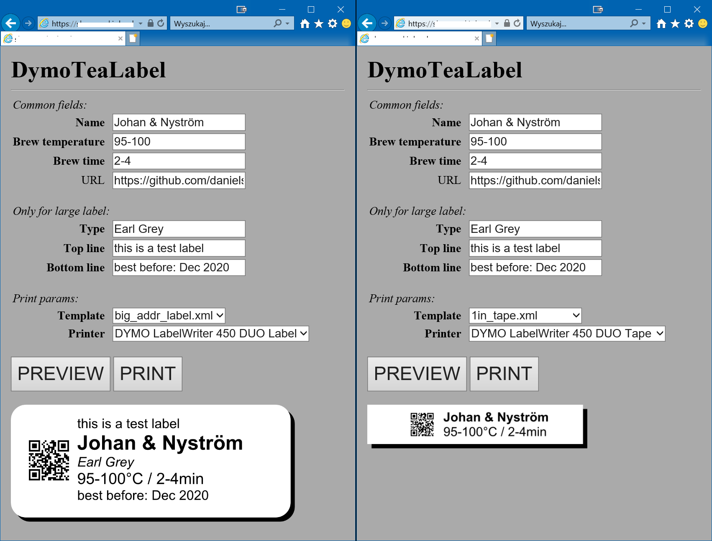

# DymoTeaLabel
Webform to quickly generate Dymo Label Printer files (and print them) for tea caddys

You'll need full **Dymo Label** software installed on Windows or macOS and **DYMO.DLS.Printing.Host.exe** running (should be by default).

## Current assumptions that will be changed to user selectables some day
- 1/2" tape (D1)
- fixed 8mm width of printout
- static template
- printing on first printer found
